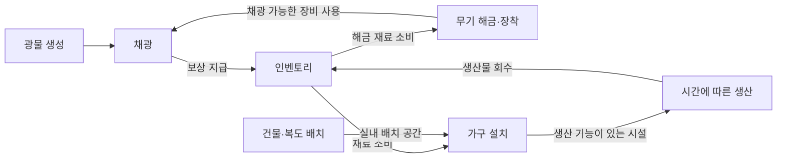
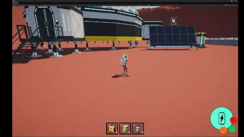
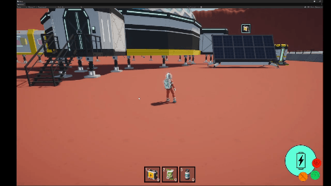
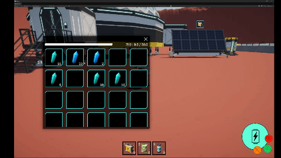

# Project: Seedling

> Unity 6 · URP 기반 3D SF 생존·기지 건설 포트폴리오 프로젝트

외계 행성에서 자원을 채집하고 시설을 설치하며 생존 기반을 확장하는 게임을 개발하고 있습니다. 현재는 건설, 인벤토리, 전투·채광, 시설 생산과 이동 기능을 확장 중인 프로토타입입니다.

게임 규칙과 화면 표시, 정적 설정과 실행 중 상태를 나누고 각 기능이 명확한 책임을 갖도록 구성하고 있습니다.

## Preview

> 대표 스크린샷은 추후 추가합니다.

<!-- media:overview
실제 자료를 추가한 뒤 위 안내 문구와 이 주석을 아래 이미지·캡션으로 교체합니다.

*외계 행성에서 자원을 모으고 시설을 설치해 생존 기반을 확장합니다.*
-->

## Project Info

| 항목 | 내용 |
| --- | --- |
| 장르 | 3D SF 생존 제작 · 기지 건설 |
| 개발 상태 | 프로토타입 개발 중 |
| 엔진 | Unity 6000.0.68f1 |
| 언어 | C# |
| 개발 기간 | 2026.07.02 ~ 진행 중 |
| 개발 인원 | 1인 개발 |
| 대상 플랫폼 | PC (Steam 배포 목표) |

## Tech Stack

| 기술 | 사용 목적 |
| --- | --- |
| Unity 6 / C# | 게임 기능, 상태 처리, Unity 컴포넌트와 개발 도구 구현 |
| Universal Render Pipeline | 3D Scene 렌더링과 시각 효과 |
| Input System | Player 입력 수집과 플레이·배치 입력 연결 |
| Cinemachine | Player 추적 및 건설 모드 카메라 제어 |
| Animation Rigging | Player 애니메이션의 Rig 제어 |
| ScriptableObject | 아이템·건물·가구·무기·생산 등의 정적 설정 정의 |
| Unity UI / TextMeshPro | 인벤토리, 건설 패널, HUD와 시설의 World UI |
| DOTween | UI 이동과 패널 전환 애니메이션 |
| Unity ObjectPool | 투사체와 타격 효과 인스턴스 재사용 |
| Unity Editor Extension | 건물·가구·인벤토리 디버그 도구와 프리팹 촬영 보조 |

Unity Registry 패키지 버전은 [manifest.json](Packages/manifest.json)에서 확인할 수 있습니다.

## My Role

혼자 개발하는 개인 프로젝트입니다.

| 구분 | 담당 범위와 기여 내용 |
| --- | --- |
| 게임플레이 프로그래밍 | 추후 추가 |
| 시스템 설계 | 추후 추가 |
| UI 구현 | 추후 추가 |
| 데이터·개발 도구 | 추후 추가 |
| 외부 에셋 활용·가공 | 추후 추가 |

## Core Gameplay Flow

플레이어는 월드에 생성된 광물을 채광해 자원을 얻고, 모은 재료로 가구를 설치하거나 무기를 해금합니다. 생산 시설에서 만든 아이템은 인벤토리로 회수하고, 해금한 무기는 장착·교체해 사용합니다. 건물과 복도는 기지의 공간을 구성하며, 건물·복도 설치의 재료 소비는 보완 중입니다.

## Key Features

현재 프로토타입의 주요 기능입니다. 시연과 플레이 검증 자료는 추후 보완합니다.

| 구현 영역 | 주요 내용 |
| --- | --- |
| 건물·복도 | 그리드에 맞춘 배치·회전, 연결 지점 선택, 복도 경로 미리보기와 신규 배치 실패 복구 |
| 가구 | 월드·건물 내부 배치, 바닥·장애물 검사, 재료 소비와 이동·제거 |
| 인벤토리 | 슬롯 이동·병합, 무게·수량 제한, 재료 소비, 실제 상태와 화면 표시 분리 |
| 자원 생성·채광 | 가중치에 따른 광물 선택, 지표면 배치·간격 검사, 채광 보상과 선택적 재생성 |
| 장비 생성·장착 | 재료를 통한 무기 해금, 주·보조 슬롯 선택, 프리팹 생성과 장비 교체 |
| 전투 | 무기별 공격, 투사체·타격 효과 재사용 |
| 이동·상태 | 제트팩, 차량 탑승, 이동·애니메이션과 상태 자원 관리 |
| 시설 생산 | 시간에 따른 생산, 시설별 보관 한도, 생산물 회수와 시설 정보 표시 |

### 1. Building — 건물과 복도 배치

플레이어가 설치 위치와 방향을 선택하면 그리드에 맞춘 미리보기를 표시합니다. 복도는 시작 연결 지점에서 직선 구간과 분기점을 조합해 경로를 정한 뒤 설치합니다.

<table>
  <tr>
    <th width="50%">건물 배치와 복도 연결</th>
    <th width="50%">연결된 건물 내부 이동</th>
  </tr>
  <tr>
    <td align="center">
      
    </td>
    <td align="center">
      
    </td>
  </tr>
</table>

*각 GIF를 클릭하면 원본 MP4 영상을 확인할 수 있습니다.*

여러 복도 모듈을 설치하다 등록이나 연결이 실패하면 일부 건물과 점유 정보만 남을 수 있습니다. 이를 막기 위해 배치할 모듈과 점유 셀을 먼저 계획하고, 모든 모듈의 생성·등록을 마친 뒤 연결을 시도합니다. 신규 경로 배치에 실패하면 이번 요청으로 만든 모듈과 점유·연결 정보를 되돌립니다.

미리보기와 실제 설치가 같은 배치 계획을 사용하므로 경로 계산과 월드 변경을 각각 관리할 수 있습니다. 신규 경로가 일부만 설치된 상태로 남는 것도 방지합니다.

[건물·복도 배치 구조 자세히 보기](docs/systems/Building.md)

### 2. Inventory — 아이템 관리와 화면 반영

획득한 아이템은 기존의 같은 아이템 스택부터 채우고 남은 수량을 빈 슬롯에 넣습니다. 슬롯 조작 시에는 목적지 상태에 따라 이동·병합·교환을 처리하고 결과를 화면에 반영합니다.

*GIF를 클릭하면 원본 MP4 영상을 확인할 수 있습니다.*

화면에서 슬롯·수량·무게 규칙까지 처리하면 UI와 게임 상태가 강하게 결합됩니다. 실제 인벤토리를 변경하는 영역과 화면의 표시 상태를 분리해, 채광·재료 소비·생산물 회수가 같은 인벤토리 규칙을 사용하고 UI는 전달받은 상태를 표시하도록 구성했습니다.

변경 결과는 다음 프레임부터 순서대로 전달합니다. 이때 연결 버전을 확인해 인벤토리 연결 대상이 바뀌기 전에 예약한 결과가 새 연결 상태에 적용되지 않도록 합니다.

[인벤토리 처리와 화면 반영 자세히 보기](docs/systems/Inventory.md)

### 3. Production — 시설 생산과 생산물 회수

생산 기능이 있는 건물과 가구는 각자의 시간과 보관량을 관리합니다. 생산 간격이 지나면 아이템이 쌓이고, 보관 한도에 도달하면 추가 생산을 멈춥니다. 생산 설정은 공유하면서 시설별 진행 상태와 시간 전달, 회수 처리는 나누어 구성했습니다.

> 시설 생산과 생산물 회수 시연 GIF는 추후 추가합니다.

<!-- media:production
실제 자료를 추가한 뒤 위 안내 문구와 이 주석을 아래 이미지·캡션으로 교체합니다.

*인벤토리가 수용한 만큼 생산물을 회수하고, 남은 수량은 시설에 보관합니다.*
-->

생산물을 회수할 때는 인벤토리에 실제로 들어간 수량만큼 시설의 보관량을 줄여야 합니다. 회수할 수량을 먼저 꺼내 상태 변경 알림에서 같은 수량이 다시 처리되지 않도록 하고, 인벤토리에 들어가지 않은 수량은 시설에 복원한 뒤 최종 보관량을 알립니다.

예를 들어 보관된 10개 중 인벤토리가 4개만 수용하면 나머지 6개는 시설에 남습니다. 회수할 때 진행 중인 생산 시간도 유지합니다.

[시설 생산과 회수 처리 자세히 보기](docs/systems/Production.md)

### 4. Resource & Mining — 자원 생성과 채광

지정한 영역에 광물을 생성할 때 설정된 가중치로 종류를 선택하고, 해당 광물의 크기 범위 안에서 크기를 정합니다. 선택한 크기는 외형과 체력, 보상 수량에 반영됩니다.

> 광물 채광과 자원 획득 시연 GIF는 추후 추가합니다.

<!-- media:mining
실제 자료를 추가한 뒤 위 안내 문구와 이 주석을 아래 이미지·캡션으로 교체합니다.

*광물을 끝까지 채광하면 광물이 제거되고 인벤토리에 수용 가능한 보상이 들어옵니다.*
-->

무작위로 선택한 위치에 광물을 놓기 전에 지표면 방향과 주변 간격을 확인합니다. 표면을 찾는 과정과 광물 생성·개체 수 관리를 나누어 배치 영역과 광물 분포를 설정으로 조정할 수 있도록 했습니다. 배치할 공간이 부족할 때 탐색이 끝없이 이어지지 않도록 시도 횟수도 제한합니다.

플레이어가 채광하면 장비의 채광 가능 여부와 사거리·쿨다운을 검사한 뒤 피해를 적용합니다. 체력이 소진된 광물은 인벤토리에 보상을 지급하고 제거하며, 개체 수 유지 모드에서는 완료 알림으로 부족한 수를 파악해 일정 시간 뒤 하나씩 보충합니다.

[자원 생성과 채광 흐름 자세히 보기](docs/systems/ResourceMining.md)

### 5. Equipment — 장비 생성과 장착·교체

재료를 소비해 무기를 해금한 뒤 주·보조 슬롯에 배치합니다. 주 슬롯이 바뀌면 해당 무기를 손의 장착 위치에 생성해 들도록 합니다.

> 무기 선택과 장비 교체 시연 GIF는 추후 추가합니다.

<!-- media:equipment
실제 자료를 추가한 뒤 위 안내 문구와 이 주석을 아래 이미지·캡션으로 교체합니다.

*주 무기 슬롯을 변경하면 손에 든 장비도 해당 무기로 바뀝니다.*
-->

무기의 해금·슬롯 규칙과 실제 장착 객체의 관리를 분리하고, 프리팹을 찾아 새 객체를 만드는 작업도 생성 담당 객체에 맡겼습니다. 한 번 읽은 프리팹 참조는 보관해 다음 생성에도 사용합니다.

장비를 교체할 때는 새 객체가 생성된 뒤 현재 장비를 바꾸고 변경을 알린 다음, 이전 장비를 제거합니다. 새 프리팹을 찾지 못하면 기존 장착 객체를 유지하므로 생성 실패로 들고 있던 장비까지 사라지는 상황을 막습니다.

[장비 생성과 장착 구조 자세히 보기](docs/systems/Equipment.md)

## Documentation

| 문서 | 내용 |
| --- | --- |
| [Architecture](docs/ARCHITECTURE.md) | 설계 원칙, 전체 연결 관계, 폴더별 책임과 세션 초기화 |
| [Building](docs/systems/Building.md) | 건물·복도·가구의 배치, 점유·연결 규칙과 실패 처리 |
| [Inventory](docs/systems/Inventory.md) | 슬롯·무게·소비 규칙, 변경 요청과 화면 반영 |
| [Production](docs/systems/Production.md) | 생산 시간·보관량·회수와 시설 정보 표시 |
| [Resource & Mining](docs/systems/ResourceMining.md) | 광물 선택·배치·보충, 채광 조건과 보상 처리 |
| [Equipment](docs/systems/Equipment.md) | 무기 해금·슬롯 상태, 장비 생성·장착·교체 |

## Getting Started

| 항목 | 내용 |
| --- | --- |
| Unity | 6000.0.68f1 |
| 대표 실행 Scene | 추후 확정 |
| 실행 절차 | 추후 추가 |
| 조작법 | 추후 추가 |
| 배포 빌드 | 추후 추가 |

## Future Improvements

- 건물·복도 배치와 재료 소비 연결
- 대표 실행 Scene 정리와 기능별 플레이 검증
- 중력 안정장과 시설 유지 관리
- 작업 클론과 생산 확장
- 저장·불러오기
- 검증 결과를 포함한 개발 사례 정리

현재 요청 전달은 로컬 구현입니다. 중력 안정장·작업 클론·저장·불러오기는 향후 계획에 해당합니다.

## Third-party Assets

외부 에셋의 이름·출처·사용 범위는 확인 후 추가합니다.

| 분류 | 에셋·도구 | 출처 | 사용 범위 |
| --- | --- | --- | --- |
| 패키지·도구 | 추후 추가 | 추후 추가 | 추후 추가 |
| 모델·애니메이션 | 추후 추가 | 추후 추가 | 추후 추가 |
| UI·VFX | 추후 추가 | 추후 추가 | 추후 추가 |
| 폰트·오디오 | 추후 추가 | 추후 추가 | 추후 추가 |

## Contact

- GitHub: 추후 추가
- 연락처·포트폴리오 링크: 추후 추가
