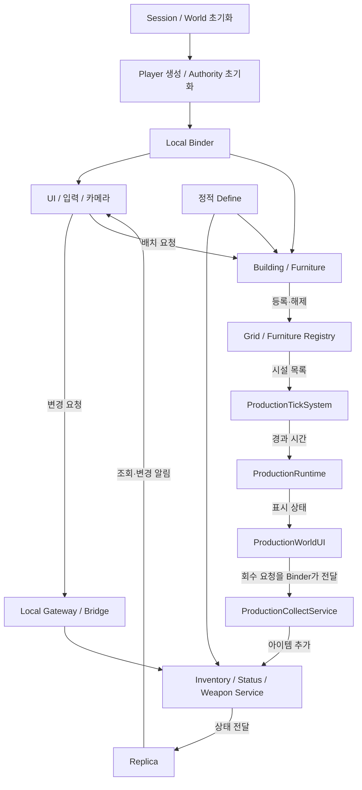
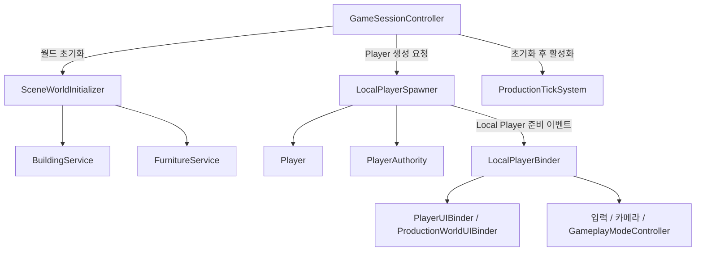
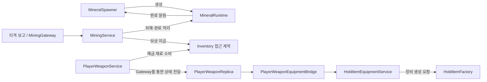

# Project: Seedling Architecture

게임 소개와 시연은 [프로젝트 README](../README.md)에서, 기능별 세부 동작은 아래 시스템 문서에서 다룹니다.

이 문서는 현재 코드의 전체 구성, 시스템 사이의 연결, 공통 설계 원칙을 설명합니다. 기준은 현재 작업 폴더의 코드이며 Scene 실행·빌드·성능 검증 결과는 추후 보완합니다.

## 문서 구성

| 문서 | 담당할 설명 |
| --- | --- |
| [README](../README.md) | 게임 소개, 시연, 기술 사용 목적, 담당 범위와 대표 설계 |
| ARCHITECTURE.md | 전체 시스템 관계, 공통 원칙, 폴더 책임과 초기화 |
| [Building](systems/Building.md) | 건물·복도·가구의 배치와 이동·제거, 실패 처리 |
| [Inventory](systems/Inventory.md) | 상태·규칙, 요청 전달, Snapshot과 화면 반영 |
| [Production](systems/Production.md) | 생산 진행, 보관과 회수, 시설 UI |
| [Resource & Mining](systems/ResourceMining.md) | 광물 선택·지표면 배치·보충, 채광 조건과 보상 지급 |
| [Equipment](systems/Equipment.md) | 무기 해금·슬롯 상태, 프리팹 생성과 장착·교체 |
| [미디어 안내](media/README.md) | 시연 자료 파일과 문서 연결 방법 |

기능별 문서는 목적·문제·클래스 역할·처리 흐름·실패 처리·설계 이유·현재 제약·코드 링크 순서로 구성합니다. 공통 정책은 이 문서에서 관리하고, 기능별 세부 규칙은 해당 기능 문서에서 관리합니다.

## 설계 배경과 원칙

이전 Random Tower Defence에서는 Managers가 전역 접근점으로 커지고, Data·Game·Session·Save·UI·Scene Runtime의 경계가 흐려졌습니다. 정적 데이터와 실행 중 상태가 섞이고 Factory와 Player·Controller에 여러 책임이 집중되는 문제도 있었습니다.

Project: Seedling은 각 클래스가 명확한 책임을 갖고 기능을 확장할 수 있는 구조를 목표로 합니다.

- 정적 데이터와 실행 중 상태를 분리합니다.
- UI는 요청과 표시를 담당하며 게임 상태를 직접 수정하지 않습니다.
- Player 조작 계열은 게임 규칙을 담당 Service에 요청합니다.
- Factory는 생성, Registry는 대상·점유 정보 관리, Service는 요청과 규칙 조율을 담당합니다.
- System은 Tick 기반 반복 처리를 담당합니다.
- SaveService를 도입하면 저장·로드·DTO 변환만 담당하게 합니다.
- 중력 안정장 판정은 향후 GravityFieldService로 중앙화합니다.
- GameContext 등 새로운 연결 객체를 도입하더라도 전역 Managers처럼 사용하지 않습니다.
- Resources.Load가 필요한 경우 Factory나 전용 데이터 접근 계층에서 감쌉니다.

이 원칙은 설계 기준입니다. 현재 모든 기능의 구조가 동일하거나 모든 분리가 완료되었다는 의미는 아닙니다.

## 전체 연결 관계

아래 화살표는 주요 초기화·연결·조회·요청 관계를 요약합니다. 클래스의 모든 참조나 매 Frame의 호출 순서를 나타내지는 않습니다.

현재 전달 방식은 같은 프로세스 안에서 동작하는 Local 구현입니다. 인벤토리의 응답 큐 구조가 모든 기능에 동일하게 적용된 것은 아니며, 건설과 생산 회수는 연결된 Service·접근 계약을 직접 사용합니다.

## 폴더와 책임

| 폴더 | 현재 역할 |
| --- | --- |
| [01.Scenes](../Assets/_Project/01.Scenes) | 프로젝트 Scene |
| [02.Scripts/_Core](../Assets/_Project/02.Scripts/_Core) | 세션 시작, 플레이 모드 전환, 로컬 응답 전달, 공통 Pool 기반 |
| [02.Scripts/_Data](../Assets/_Project/02.Scripts/_Data) | ScriptableObject 등 정적 데이터의 형식 |
| [02.Scripts/Input](../Assets/_Project/02.Scripts/Input) | 입력 수집과 입력 접근 계약 |
| [02.Scripts/Player](../Assets/_Project/02.Scripts/Player) | Player 구성, 조작, 생성·연결, 상태·무기·소모품 관련 권한 기능 |
| [02.Scripts/Camera](../Assets/_Project/02.Scripts/Camera) · [Vehicle](../Assets/_Project/02.Scripts/Vehicle) | 카메라 제어와 차량 탑승·이동 |
| [02.Scripts/Inventory](../Assets/_Project/02.Scripts/Inventory) | 인벤토리 규칙, 상태, 요청 전달과 표시용 복제 상태 |
| [02.Scripts/Mineral](../Assets/_Project/02.Scripts/Mineral) | 광물 생성·개체 수 유지, 광물 상태와 채광 규칙 |
| [02.Scripts/Combat](../Assets/_Project/02.Scripts/Combat) | 장비 생성·장착 객체 관리, 공격과 투사체 |
| [02.Scripts/Building](../Assets/_Project/02.Scripts/Building) | 건물·복도 배치, Grid와 Connector, 이동·제거 |
| [02.Scripts/Furniture](../Assets/_Project/02.Scripts/Furniture) | 가구 배치·이동·제거, 배치 공간과 점유 관리 |
| [02.Scripts/Production](../Assets/_Project/02.Scripts/Production) | 생산 상태, 시간 전달, 생산물 회수 |
| [02.Scripts/UI](../Assets/_Project/02.Scripts/UI) | View·Panel, Presenter, UI 연결과 표시 |
| [02.Scripts/World](../Assets/_Project/02.Scripts/World) | 시작 시설 초기화, 지표면 배치 위치 탐색, 월드 상호작용·조회 계약과 시각 표현 |
| [02.Scripts/Editor](../Assets/_Project/02.Scripts/Editor) · [Tool](../Assets/_Project/02.Scripts/Tool) | 디버그·촬영·편집 보조 도구 |
| [03.Prefabs](../Assets/_Project/03.Prefabs) | 프로젝트 Prefab |
| [04.Art](../Assets/_Project/04.Art) | 프로젝트 아트와 애니메이션 |
| [06.Data](../Assets/_Project/06.Data) | 정적 데이터 형식으로 만든 실제 설정 에셋 |
| [07.Terrain](../Assets/_Project/07.Terrain) | Terrain과 Heightmap |

_Data는 설정의 형식을 정의하는 코드입니다. 06.Data는 그 형식으로 만든 설정 에셋이고, 플레이 중 변하는 수량·위치·생산 시간은 각 기능의 상태 객체가 관리합니다.

기능별 폴더를 유지하고 필요한 책임을 각 기능 내부에서 나눕니다. 폴더 이름만으로 의존이 차단되는 것은 아니므로 코드의 참조와 요청 경계를 함께 관리해야 합니다.

## 역할별 경계

| 역할 | 책임 | 예시 |
| --- | --- | --- |
| Controller | 입력 해석과 조작·선택 상태 | BuildingPlacementController |
| Calculator / Planner / Validator | 계산, 계획과 조건 검사 | CorridorRoutePlanner, BuildValidator |
| Service | 요청과 규칙 실행 순서 조율 | InventoryService, FurnitureService |
| Runtime / Registry | 실행 중 상태 / 등록 대상·점유 정보 | ProductionRuntime, GridRegistry |
| Factory / System | 생성 / 반복 처리 | HoldItemFactory, ProductionTickSystem |
| Gateway / Bridge / Replica | 요청·상태 전달 / 표시 측 상태 | LocalInventoryGateway, InventoryReplica |
| Binder / Presenter / View | 연결 / 표시 변환 / 화면 갱신 | LocalPlayerBinder, InventoryPresenter, InventoryPanel |

현재 BuildingService와 FurnitureService는 Instantiate를 직접 호출합니다. 별도 Factory가 필요해질 경우 생성 정책을 분리하고, 등록·연결·재료 소비·실패 복구의 조율은 Service에 남기는 방향입니다.

MineralSpawner는 자신의 광물 생성·목록·보충을 함께 관리합니다. 광물 배치 위치 탐색은 SurfaceSpawnArea, 채광 조건과 보상 처리는 MiningService에 나뉘어 있지만 별도 광물 Factory·Registry·Tick System으로 분리된 구조는 아닙니다. 장비는 HoldItemFactory가 프리팹 조회·생성을, HoldItemEquipmentService가 현재 장착 객체와 교체를 담당합니다.

## 세션 초기화

현재 실행 시작의 중심은 [GameSessionController](../Assets/_Project/02.Scripts/_Core/Session/GameSessionController.cs)입니다.

1. Awake에서 ProductionTickSystem을 비활성화합니다.
2. BeginSession에서 SceneWorldInitializer.Init을 호출합니다.
3. 시작 건물의 배치·등록과 Connector 연결을 수행한 뒤 시작 가구를 등록합니다.
4. PlayerSpawner.BeginSpawn을 호출합니다. 현재 구체 구현은 LocalPlayerSpawner입니다.
5. LocalPlayerSpawner가 Player와 PlayerAuthority를 생성하고 권한 기능 및 Local 전달 계층을 초기화·연결합니다.
6. Local Player 준비 이벤트를 받은 LocalPlayerBinder가 UI·카메라·건설 입력·플레이 모드를 연결합니다.
7. BeginSpawn이 반환되면 GameSessionController가 생산 Tick을 활성화하고 시작 상태를 기록합니다.

[PlayerAuthority](../Assets/_Project/02.Scripts/Player/Authority/PlayerAuthority.cs)는 Inventory·Status·Consumable·Weapon 기능의 초기화와 접근점을 제공합니다. 각 기능의 규칙은 담당 Service에서 처리합니다.

[LocalPlayerBinder](../Assets/_Project/02.Scripts/Player/Binder/LocalPlayerBinder.cs)는 생성된 Player의 입력과 조회·요청 접근점을 외부 시스템에 연결합니다. 재료 소비나 생산 규칙 자체를 실행하는 곳은 아닙니다.

MineralSpawner는 자신의 Start에서 초기 광물을 생성하고 설정에 따라 보충을 시작합니다. 위 GameSessionController의 시설·Player 초기화 단계가 직접 실행하는 대상은 아닙니다.

## 기능 간 의존 관계

| 기능 | 주요 경계 |
| --- | --- |
| 전투 | HoldItemAttackService가 공격을 조율하고 IHoldItemAttack 등의 계약을 구현한 공격 Behaviour를 사용 |
| 투사체·효과 | ProjectilePool과 HitImpactEffectPool이 ComponentPool 기반으로 인스턴스를 재사용 |
| [자원 생성](systems/ResourceMining.md) | MineralSpawnProfile의 설정과 SurfaceSpawnArea의 표면 탐색을 MineralSpawner가 사용하고, MineralRuntime 완료 알림으로 관리 개체 수 갱신 |
| [채광](systems/ResourceMining.md) | 타격 보고를 MiningGateway가 전달하고 MiningService가 사거리·쿨다운·광물 조건 검사 후 IInventoryItemReceiver로 보상 지급 |
| [무기 해금·슬롯](systems/Equipment.md) | PlayerWeaponService가 Inventory 재료 소비와 해금·Loadout 규칙을 조율하고, Local Gateway가 Snapshot을 Replica에 전달 |
| [장비 생성·장착](systems/Equipment.md) | PlayerWeaponEquipmentBridge가 Replica의 주 무기를 장착 요청으로 바꾸고, HoldItemEquipmentService가 Factory를 통한 생성과 교체 처리 |
| 상태·소모품 | PlayerStatusService가 상태 자원을 처리하고 ConsumableUseService가 아이템 소비와 회복을 조율 |
| 제트팩 | JetpackService가 에너지 요청을 Gateway에 전달하고 이동 기능에서 추진 상태 사용 |
| 차량 | VehicleMountService가 탑승·하차를 조율하고 입력·이동·애니메이션은 각 컴포넌트가 담당 |
| 화면 표시 | PlayerUIBinder가 Player의 조회·요청 접근점을 UI Controller와 Presenter에 연결 |

장비의 해금·슬롯 상태와 실제 장착 객체는 서로 다른 단계에서 갱신됩니다. 프리팹 생성 실패가 앞서 변경한 무기 상태까지 되돌리는 구조는 아니며, 상세 제약은 Equipment 문서에서 다룹니다.

Player 폴더에는 조작 코드와 함께 권한 Service도 존재합니다. 폴더 이름 전체를 단일 계층으로 취급하지 않고, 클래스별 책임과 의존 대상을 기준으로 해석합니다.

## 오류와 초기화 계약

- 재료 부족, 점유 충돌, 사거리 초과와 같은 정상적인 게임 실패는 false·결과 타입·상태 값으로 표현합니다.
- 필수 참조 누락과 초기화 누락은 개발·설정 오류로 구분합니다.
- Inspector 설정, RequireComponent, OnValidate와 개발 검증을 통해 필수 의존을 확인합니다.
- 필수 의존을 자동 검색·생성하거나 무시하여 잘못된 상태로 실행을 계속하지 않습니다.
- 선택적 의존은 계약에서 명확히 표현합니다. 생산 기능이 없는 시설의 Production이 null인 경우가 해당합니다.
- 예외를 처리할 때는 현재 계층이 복구하거나 정의된 결과로 변환할 수 있어야 합니다.

오류 처리와 주석 기준의 세부 규칙은 [AGENTS.md](../AGENTS.md)를 따릅니다.

## 실행 기준과 검증 상태

- Unity 버전은 [ProjectVersion.txt](../ProjectSettings/ProjectVersion.txt), 패키지 버전은 [manifest.json](../Packages/manifest.json)을 기준으로 합니다.
- 현재 [빌드 설정](../ProjectSettings/EditorBuildSettings.asset)은 SampleScene을 포함합니다. 새 월드 초기화·생산 연결은 DemoTerrain에서 확인되므로 대표 실행 Scene을 확정한 뒤 실행 안내를 보완합니다.
- 기능별 문서의 검증 항목은 확인할 시나리오입니다. 실행을 완료한 테스트 결과와 구분합니다.
- 기능별 미완성 처리와 제약은 각 문서의 '현재 제약과 개선'에 기록합니다.

## 장기 기획과 구조 방향

Project: Seedling은 이전에 Gravity Ark라는 이름으로 기획되었으며 현재 명칭은 임시 프로젝트명입니다.

기획상 플레이어는 외계 행성의 거대한 분지에 불시착한 뒤 중력 안정장을 복구해 생존권을 만들고, 자원 채집·시설 건설·내구도 관리·식량 생산·작업 클론 배치를 통해 Gene Ark를 안정화합니다. 최종 목표는 탈출선을 제작해 행성을 벗어나는 것입니다.

1인칭·3인칭 전환, 중력 안정장, 작업 클론 등의 기획 요소는 구현 여부와 구분해서 기록합니다.

| 향후 영역 | 책임 방향 |
| --- | --- |
| 중력 안정장 | GravityFieldService에 판정 중앙화 |
| 저장·불러오기 | SaveService는 저장·로드·DTO 변환을 담당하고 게임 규칙은 담당 Service 유지 |
| 시설 내구도 | 반복적인 상태 처리는 담당 System으로 분리 |
| 작업 클론 | 생성, 등록, 배치·할당 요청, 반복 소비의 책임 구분 |
| 데이터·Scene 관리 | 공통 접근이 실제로 필요해질 때 전용 계층 도입 검토 |
| 멀티플레이 | 현재 Local 전달 구조를 출발점으로 전송·권한 검증·상태 동기화를 별도 설계 |

기존 설계에 등장했던 GameContext, WorldRuntime, DataService, SaveService, CloneService 등의 이름은 현재 구현 클래스 목록이 아닙니다. 현재 구조의 출발점은 GameSessionController와 LocalPlayerSpawner이며, 장기 설계는 실제 확장 요구에 따라 구체화합니다.

기술 기준은 Unity 6000.x와 URP입니다. Built-In Render Pipeline을 사용하지 않으며 Resources.Load는 전용 접근 계층에서 관리합니다.
