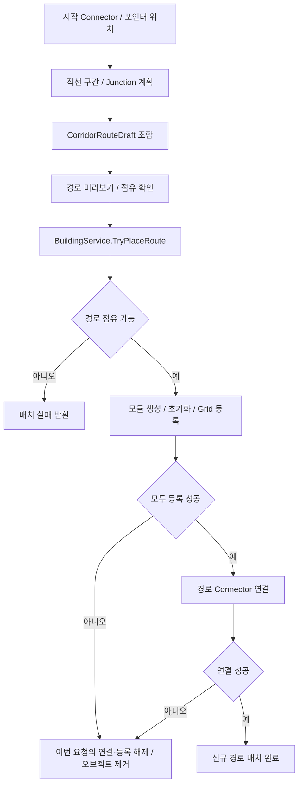

# Building System

[프로젝트 소개](../../README.md) · [전체 아키텍처](../ARCHITECTURE.md) · [Inventory](Inventory.md) · [Production](Production.md)

## 목적과 현재 범위

건물·복도·가구를 배치하고 점유 정보와 연결 상태를 관리합니다. 이 문서는 현재 코드의 처리 순서를 설명하며, 플레이 검증 결과와 시연 자료는 추후 추가합니다.

- 건물: 그리드 배치·회전, 셀 점유 검사, Connector 연결, 이동·제거
- 복도: 직선 구간과 Junction 계획, 미리보기, 여러 모듈의 일괄 신규 배치
- 가구: 월드·건물 내부의 위치 계산, 지지 표면·충돌 검사, 재료 소비와 이동·제거

건물·복도 배치의 재료 소비는 아직 연결되어 있지 않습니다. 가구 배치는 재료 확인과 소비를 수행합니다.

## 해결하려는 문제

- 마우스 위치와 회전으로 계산한 미리보기를 실제 배치 위치·점유 정보와 일치시켜야 합니다.
- 복도 모듈 일부의 등록·연결이 실패했을 때 이번 요청의 일부 오브젝트만 남는 상태를 정리해야 합니다.
- 가구 설치 공간과 소속 건물, 인벤토리 재료 조건을 함께 검사해야 합니다.
- UI·입력 코드가 직접 재료를 소비하거나 건물 생성·등록 규칙을 처리하지 않도록 경계를 정해야 합니다.

## 주요 클래스와 책임

| 역할 | 클래스 | 책임 |
| --- | --- | --- |
| 건설 조작 상태 | Building, BuildInputController | 입력 전달, 모드와 선택 상태 |
| 단일 배치 후보 | BuildingPlacementController, BuildingPlacementCalculator | 후보 위치·회전·점유 셀 계산과 갱신 |
| 미리보기 | BuildPreviewController, CorridorRoutePreviewController | 후보와 배치 가능 여부 표시 |
| 복도 계획 | CorridorConstructionController, CorridorRoutePlanner, CorridorRouteDraft | 직선 구간·Junction과 확정·미리보기 경로 조합 |
| 점유 검사 | BuildValidator, GridRegistry | 배치 후보 셀의 점유 확인과 등록 정보 관리 |
| 배치 실행 | BuildingService | Runtime 생성·초기화, 등록·연결과 신규 배치 복구 |
| 연결 규칙 | BuildingConnectionService, BuildingConnector | Connector 연결·해제와 상태 |
| 이동·제거 | BuildingModificationService, BuildingRemoveService | 기존 건물의 위치 변경·제거 요청 |
| 가구 조작·계산 | FurnitureController, FurniturePlacementCalculator | 가구 선택과 현재 배치 후보 |
| 가구 검증 | FurniturePlacementValidator | 설치 공간·소속 건물·표면·충돌 검사 |
| 가구 실행·등록 | FurnitureService, FurnitureRegistry | 생성·재료 소비·이동·제거와 공간별 점유 관리 |
| 설정·상태 | BuildingDefine / FurnitureDefine, BuildingRuntime / FurnitureRuntime | 정적 설정과 개별 설치물의 상태 |

## 처리 흐름

### 단일 건물

1. 입력으로 선택 위치와 회전을 갱신합니다.
2. BuildingPlacementCalculator가 배치 후보와 점유 셀을 계산합니다.
3. BuildingService를 통해 점유 가능 여부를 조회하고 미리보기를 표시합니다.
4. 설치 요청 시 BuildingService가 현재 점유를 다시 검사합니다.
5. Runtime 생성·초기화, Grid 등록, Connector 연결을 순서대로 수행합니다.
6. 등록 실패 시 생성 오브젝트를 제거하고, 연결 실패 시 등록을 해제한 뒤 제거합니다.

### 복도 경로

CorridorRoutePlanner는 Connector 기준의 구간 길이와 모듈 배치를 계산합니다. CorridorRouteDraft는 확정한 구간과 현재 Junction을 관리하고 미리보기 구간을 결합합니다.

TryPlaceRoute는 전체 점유 검사 후 모든 모듈을 생성·등록하고 연결을 시도합니다. 연결 과정에서 실패하면 이번 요청의 건물 목록을 사용해 연결·Grid 등록을 해제하고 오브젝트를 제거합니다.

### 가구 배치

1. 후보 위치·회전을 월드 공간 또는 소속 건물 기준으로 계산합니다.
2. FurniturePlacementValidator가 공간·표면·충돌 조건을 검사하고 Service가 재료 보유량을 확인합니다.
3. FurnitureService가 가구를 생성·초기화하고 FurnitureRegistry에 등록합니다.
4. IInventoryConsumption.TryConsume으로 재료 소비를 요청합니다.
5. 소비 실패 시 등록을 해제하고 생성한 가구를 제거합니다.

FurnitureRegistry는 공간 종류, 소속 건물, 셀 좌표를 조합해 점유를 관리합니다. 따라서 건물 내부의 같은 셀 좌표라도 소속 건물이 다르면 구분할 수 있습니다.

### 시작 시설과 기존 시설 변경

- SceneWorldInitializer는 시작 건물 등록과 연결을 마친 뒤 시작 가구를 등록합니다. 시작 시설 등록은 Scene의 기존 오브젝트를 사용합니다.
- FurnitureService.RegisterExisting은 시작 가구의 위치를 맞추고 등록하며 재료를 소비하지 않습니다.
- 건물 이동은 연결 해제 → 점유 갱신 → 위치·회전 변경 → 새 연결 순서입니다.
- 가구 이동은 후보 검증 → Registry 위치 갱신 → Transform·Runtime 위치 반영 순서입니다.
- 제거 요청은 각 Service가 등록과 연결을 정리한 뒤 오브젝트를 제거합니다.

## 실패 조건과 복구

| 상황 | 현재 처리 |
| --- | --- |
| 건물·복도 후보 셀 점유 충돌 | 배치 실패 반환 |
| 단일 건물 Grid 등록 실패 | 새 오브젝트 제거 |
| 단일 건물 Connector 연결 실패 | 새 등록 해제 후 오브젝트 제거 |
| 신규 복도 모듈의 등록·연결 실패 | 이번 요청의 모듈 연결·등록을 해제하고 제거 |
| 가구의 설치 조건 불충족·재료 부족 | 생성 전에 배치 거절 |
| 가구 등록 후 재료 소비 실패 | 등록 해제 후 새 가구 제거 |
| 가구 소비 실패의 복구 과정에서 등록 해제 실패 | 개발 오류로 예외 발생 |
| 시작 시설의 Define 누락·잘못된 점유 등 | 초기화 단계에서 개발·설정 오류로 처리 |

이 표의 복구 범위는 신규 배치 경로입니다. 기존 건물 이동은 후반 단계가 실패했을 때 원래 점유·Transform·연결로 되돌리는 처리가 현재 메서드에 없으므로 동일한 복구 보장을 적용하지 않습니다.

## 설계 선택과 효과

- **계획과 실행 분리:** 경로 계산 결과를 미리보기와 실제 배치에 사용하면서 월드 변경 지점을 Service에 모읍니다.
- **점유와 연결 분리:** GridRegistry는 셀 점유, BuildingConnectionService는 Connector 관계를 다룹니다.
- **가구 공간 식별:** 월드·건물 내부 배치의 좌표 기준과 소속을 명시합니다.
- **소비 접근 계약:** 가구 Service는 Inventory 내부 슬롯을 조작하지 않고 재료 소비 기능을 요청합니다.
- **실패 범위 추적:** 신규 복도 요청에서 생성한 목록을 보관해 해당 요청의 변경을 정리합니다.

## 현재 제약과 개선

- BuildValidator는 셀 점유를 검사합니다. 지형·환경·중력 안정장까지 검증하는 기능은 별도 확장 범위입니다.
- 건물·복도 배치에 재료 소비를 연결하고 배치·소비의 실패 순서를 Service에서 조율해야 합니다.
- 기존 건물 이동의 실패 복구 정책을 보완해야 합니다.
- BuildingService와 FurnitureService는 현재 Instantiate를 직접 호출합니다. 생성 정책이 복잡해질 경우 Factory 분리를 검토합니다.
- 시연과 실행 결과는 추후 추가합니다.

확인할 시나리오는 중복 셀 배치, 복도 모듈 중간 연결 실패, 가구 재료 부족, 가구 재배치의 자기 점유 제외, 시작 시설 등록 순서입니다. 위 항목은 검증 계획이며 테스트 통과 결과가 아닙니다.

## 코드 링크

- [BuildingService](../../Assets/_Project/02.Scripts/Building/Placement/BuildingService.cs)
- [CorridorRoutePlanner](../../Assets/_Project/02.Scripts/Building/Corridor/CorridorRoutePlanner.cs)
- [CorridorRouteDraft](../../Assets/_Project/02.Scripts/Building/Corridor/CorridorRouteDraft.cs)
- [BuildingConnectionService](../../Assets/_Project/02.Scripts/Building/Connector/BuildingConnectionService.cs)
- [BuildingModificationService](../../Assets/_Project/02.Scripts/Building/Modification/BuildingModificationService.cs)
- [FurnitureService](../../Assets/_Project/02.Scripts/Furniture/FurnitureService.cs)
- [FurniturePlacementValidator](../../Assets/_Project/02.Scripts/Furniture/Placement/FurniturePlacementValidator.cs)
- [FurnitureRegistry](../../Assets/_Project/02.Scripts/Furniture/Grid/FurnitureRegistry.cs)
