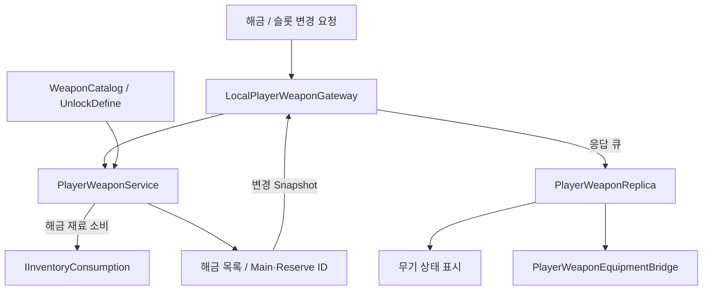
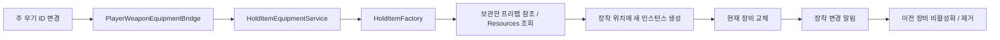

# Equipment System

[프로젝트 소개](../../README.md) · [전체 아키텍처](../ARCHITECTURE.md) · [Inventory](Inventory.md) · [Resource & Mining](ResourceMining.md)

## 목적과 현재 범위

재료를 소비해 무기를 해금하고 주·보조 슬롯에 배치하며, 현재 주 무기에 맞는 장착 객체를 생성·교체합니다. 사용 가능한 무기와 슬롯의 상태는 권한 Service가 관리하고 실제 손에 드는 객체는 장착 Service가 관리합니다. 시연과 플레이 검증 결과는 추후 추가합니다.

- 무기별 해금 재료와 해금 상태 관리
- 주·보조 슬롯 배치·비우기·교환
- 무기 상태 전달과 주 무기의 장착 객체 연결
- ID를 통한 프리팹 조회·생성, 장착 변경 알림과 이전 객체 제거

현재 재료 소비는 무기 ID를 해금하는 데 사용합니다. 같은 무기 아이템을 여러 개 제작해 인벤토리에 쌓는 기능은 아닙니다.

## 해결하려는 문제

- 해금과 슬롯 선택 규칙이 장비 객체의 생성·제거에 종속되지 않아야 합니다.
- 주 무기의 상태가 바뀌면 표시 측이 새 무기를 생성하고 관련 기능에 장착 변경을 알려야 합니다.
- 교체할 프리팹을 찾지 못한 경우, 기존 장착 객체까지 먼저 제거하지 않아야 합니다.
- 같은 무기를 다시 생성할 때 사용할 프리팹 참조를 한곳에서 조회·보관해야 합니다.

## 주요 클래스와 책임

| 역할 | 클래스·계약 | 책임 |
| --- | --- | --- |
| 장비 설정 | HoldItemDefine | 아이템 ID, 무기 분류, 공격력·거리·쿨다운·에너지 비용과 채광 가능 여부 |
| 해금 설정 | WeaponUnlockDefine, WeaponCatalog | 무기별 필요 재료와 ID 조회 목록 |
| 무기 규칙·상태 | PlayerWeaponService | 해금 목록, 주·보조 슬롯과 재료 소비 조율 |
| 재료 소비 계약 | IInventoryConsumption | 해금에 필요한 재료 소비 |
| 상태 전달 | LocalPlayerWeaponGateway | 요청 전달, 변경 Snapshot과 완료 결과 예약 |
| 표시 측 상태 | PlayerWeaponReplica, PlayerWeaponSnapshot | 해금 목록과 슬롯 상태 조회·변경 알림 |
| 장착 연결 | PlayerWeaponEquipmentBridge | 주 무기 ID를 장착·해제 요청으로 변환 |
| 장착 객체 관리 | HoldItemEquipmentService | 현재 장비, 생성 요청, 변경 알림과 이전 객체 정리 |
| 생성 | HoldItemFactory | ID에 맞는 프리팹 조회·참조 보관과 인스턴스 생성 |
| 장비 객체 | HoldItemRuntime | 장비 설정, 애니메이션과 손잡이·조준 위치 제공 |

## 처리 흐름

### 해금과 슬롯 상태

1. 해금 요청은 Catalog에 있는 무기인지, 이미 해금했는지 확인합니다. 재료 소비에 성공하면 해금 목록에 ID를 추가합니다.
2. 슬롯 배치 요청은 유효한 슬롯·무기 ID와 해금 여부를 검사합니다.
3. 반대 슬롯에 있는 무기를 선택하면 두 슬롯을 교환합니다. 같은 슬롯에 이미 있는 무기를 다시 선택하면 변경하지 않습니다.
4. 직접 교환 요청은 두 슬롯의 ID를 맞바꾸며, 슬롯 비우기는 지정 슬롯을 빈 상태로 바꿉니다.
5. 변경된 전체 상태를 Snapshot으로 전달합니다. Replica는 이를 적용한 뒤 화면과 장착 연결에 변경을 알립니다.

신규 플레이어 초기화 시 기본 무기를 해금하고 주 슬롯에 배치합니다. Local Gateway의 최초 연결에서는 전체 상태를 즉시 적용하고, 이후 상태 변경과 요청 완료 결과는 응답 큐로 전달합니다. 연결 버전이 달라지면 이전 연결에서 예약한 전달은 적용하지 않습니다.

### 프리팹 생성과 장착 교체

1. Bridge는 Replica의 주 무기 ID를 보고 장착을 요청합니다. ID가 비어 있으면 현재 장비를 해제합니다.
2. 이미 같은 무기가 장착되어 있으면 새로 생성하지 않습니다.
3. Factory는 ID로 보관된 프리팹 참조를 찾습니다. 처음 요청한 ID이면 Resources의 Weapons/ 경로에서 읽고 성공한 참조를 저장합니다.
4. 그 프리팹으로 장착 위치 아래에 새 인스턴스를 만듭니다.
5. 생성에 성공하면 현재 장비 참조를 바꾸고 OnHoldItemChanged를 알립니다. 그 뒤 이전 장비를 비활성화하고 제거합니다.

장비 변경 알림은 장비별 애니메이션 등 표시 연결에 사용됩니다. 해제할 때는 현재 참조를 비우고 변경을 알린 뒤 이전 객체를 제거합니다.

Factory가 보관하는 것은 프리팹 참조입니다. 실제 장비는 교체할 때 새로 생성하고 이전 장비를 제거하므로, 투사체·효과에서 사용하는 인스턴스 Pool과는 수명주기가 다릅니다.

### 두 상태의 경계

무기 해금·슬롯 변경은 PlayerWeaponService에서 먼저 완료됩니다. 이후 Replica와 Bridge를 거쳐 실제 장착 객체가 바뀝니다. 장착 객체 생성에 실패하면 기존 객체를 유지하지만, 이미 바뀐 주 슬롯 ID를 되돌리지는 않습니다.

따라서 현재의 교체 순서는 장착 객체를 먼저 잃지 않기 위한 처리입니다. 해금 재료 소비부터 프리팹 생성까지 전체 과정을 함께 복구하는 기능은 포함하지 않습니다.

## 실패 조건과 상태 처리

| 상황 | 현재 처리 |
| --- | --- |
| Catalog에 없는 ID | 유효하지 않은 무기 결과 반환 |
| 이미 해금한 무기 | 중복 해금 실패, 재료 소비 없음 |
| 해금 재료 부족 | 실패 결과 반환, 해금 목록 변경 없음 |
| 유효하지 않은 슬롯·해금하지 않은 무기 | 슬롯 배치 실패 |
| 같은 슬롯에 이미 배치한 무기 | 변경 없이 AlreadyEquipped 반환 |
| 양쪽 슬롯이 모두 빈 상태에서 교환 | 실패 결과 반환 |
| 이미 비어 있는 슬롯 비우기 | AlreadyEmpty 반환 |
| 프리팹 조회 실패 | 새 장비 생성 실패, 기존 장착 객체 유지 |
| 주 슬롯 ID가 비어 있음 | 현재 장비 해제 |
| Service 초기화·Local 필수 연결 누락 | 개발 오류로 예외 발생 |

프리팹 누락은 데이터·에셋 설정 오류입니다. 현재 구현은 로그와 실패 반환으로 처리하지만, Bridge가 실패를 권한 상태에 다시 전달하는 경로는 없습니다.

## 설계 선택과 효과

- **규칙과 장착 객체 분리:** 해금·슬롯 선택과 실제 객체의 생성·제거를 각각 관리합니다.
- **ID와 Catalog:** 해금 목록과 슬롯은 ID로 기록하고 필요한 설정은 Catalog에서 찾습니다.
- **Factory의 생성 책임:** 프리팹 조회와 인스턴스 생성만 맡기고 현재 장비 교체·제거는 장착 Service에 둡니다.
- **생성 후 교체:** 프리팹 조회에 실패해도 기존 장착 객체를 남깁니다.
- **변경 알림:** 장비가 바뀌었음을 구독 측에 전달해 장비별 표시를 연결합니다.

## 현재 제약과 개선

- 권한 상태의 무기 ID와 실제 장착 객체가 생성 실패로 어긋날 수 있습니다. 프리팹 매핑 검증과 실패 피드백을 보완할 수 있습니다.
- 프리팹 조회는 Resources의 Weapons/ 경로와 아이템 ID 일치에 의존합니다.
- 장착 위치 참조의 검증이 장착 호출 방식마다 동일하지 않습니다. 공통 설정 검증은 보완 대상입니다.
- Loadout 변경 Service는 현재 Station 존재나 사용 거리를 검사하지 않습니다.
- Snapshot 기반 초기화 경로는 있지만 디스크 저장·불러오기와 네트워크 전송은 구현 범위에 포함하지 않습니다.
- 투사체·효과 재사용과 공격별 동작은 이 문서의 장비 생성·장착 범위 밖에 있습니다.

확인할 시나리오는 기본 무기 초기화, 해금 재료 부족·중복 해금, 반대 슬롯 무기 선택, 빈 슬롯과 교환, 동일 장비 재선택, 프리팹 누락, 연결 해제 후 대기 응답입니다. 위 항목은 검증 계획이며 테스트 통과 결과가 아닙니다.

## 코드 링크

- [HoldItemDefine](../../Assets/_Project/02.Scripts/_Data/Weapon/HoldItemDefine.cs)
- [WeaponUnlockDefine](../../Assets/_Project/02.Scripts/_Data/Weapon/WeaponUnlockDefine.cs)
- [WeaponCatalog](../../Assets/_Project/02.Scripts/_Data/Weapon/WeaponCatalog.cs)
- [PlayerWeaponService](../../Assets/_Project/02.Scripts/Player/Weapon/PlayerWeaponService.cs)
- [LocalPlayerWeaponGateway](../../Assets/_Project/02.Scripts/Player/Gateway/LocalPlayerWeaponGateway.cs)
- [PlayerWeaponReplica와 Snapshot](../../Assets/_Project/02.Scripts/Player/Weapon/PlayerWeaponReplica.cs)
- [PlayerWeaponEquipmentBridge](../../Assets/_Project/02.Scripts/Player/Weapon/PlayerWeaponEquipmentBridge.cs)
- [HoldItemFactory](../../Assets/_Project/02.Scripts/Combat/HoldItemFactory.cs)
- [HoldItemEquipmentService](../../Assets/_Project/02.Scripts/Combat/HoldItemEquipmentService.cs)
- [HoldItemRuntime](../../Assets/_Project/02.Scripts/Combat/HoldItemRuntime.cs)
