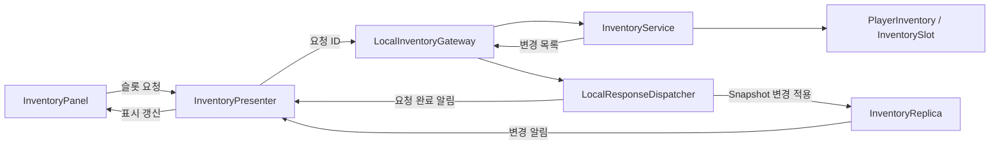

# Inventory System

[프로젝트 소개](../../README.md) · [전체 아키텍처](../ARCHITECTURE.md) · [Building](Building.md) · [Production](Production.md)

## 목적과 현재 범위

아이템의 슬롯·수량·무게와 소비 규칙을 관리하며, 실제 상태 변경과 UI에서 사용하는 표시 상태를 구분합니다. 현재는 같은 프로세스의 로컬 구현입니다. 플레이 검증과 시연 자료는 추후 추가합니다.

- 아이템 추가와 부분 수용, 슬롯 이동·병합·교환과 버리기
- 무게·스택 제한, 단일 아이템 제거와 여러 재료의 일괄 소비
- 요청 식별자, 전체 Snapshot·변경 목록, 표시용 Replica와 Presenter 연결

## 해결하려는 문제

- UI가 실제 슬롯 상태와 게임 규칙을 직접 관리하면 다른 기능이 같은 인벤토리를 사용하기 어렵습니다.
- 슬롯 공간과 남은 무게가 서로 다를 수 있어 아이템 추가는 전체 성공·부분 성공·실패를 구분해야 합니다.
- UI 요청의 완료와 상태 갱신을 연결하고, 연결 대상이 바뀐 뒤 이전 응답이 적용되는 것을 막아야 합니다.
- 여러 재료를 소비할 때 일부만 차감된 뒤 부족을 발견하는 상태를 피해야 합니다.

## 주요 클래스와 책임

| 역할 | 클래스·계약 | 책임 |
| --- | --- | --- |
| 정적 설정 | ItemDefine, BagDefine | 아이템 분류·무게·스택과 가방 설정 |
| 실제 상태 | PlayerInventory, InventorySlot | 슬롯과 현재 아이템·수량·무게 |
| 권한 기능 연결 | PlayerInventoryAuthority | InventoryService의 초기화와 접근점 |
| 게임 규칙 | InventoryService | 추가·이동·제거·소비와 결과 생성 |
| 기능 계약 | IInventoryItemReceiver, IInventoryConsumption, IInventoryItemRemover | 아이템 수신·재료 소비·제거 요청 |
| UI 계약 | IInventoryReadAccess, IInventoryCommandGateWay | 상태 조회와 슬롯 변경 요청 |
| 요청 전달 | InventoryGateway, LocalInventoryGateway | 요청 ID, 로컬 Service 호출과 응답 연결 |
| 지연 전달 | LocalResponseDispatcher | 다음 Frame부터 FIFO 순서로 응답 전달 |
| 표시 측 상태 | InventoryReplica | 전체 Snapshot과 변경 목록 적용 |
| 화면 연결 | InventoryPresenter, InventoryPanel, HotkeyPanel | 슬롯·무게·핫키 표시와 사용자 요청 |

## 처리 흐름

### UI 요청과 상태 전달

요청 완료 알림은 큐에 등록된 콜백에서 Gateway가 발생시키고 Presenter가 구독합니다. 위 도식은 해당 전달을 간략히 나타냅니다.

1. LocalInventoryGateway 연결 시 전체 Snapshot을 InventoryReplica에 적용합니다.
2. Presenter가 슬롯 이동·버리기를 요청하면 Gateway가 요청 ID를 만들고 로컬 Service를 호출합니다.
3. Service가 규칙을 검사하고 상태를 변경한 뒤 변경 목록을 발생시킵니다.
4. LocalInventoryGateway는 전달할 슬롯 배열을 복사하고 응답 큐에 등록합니다.
5. 현재 Frame보다 먼저 등록된 응답부터 FIFO로 처리합니다. 같은 Frame의 응답과 처리 중 등록한 응답은 다음 Frame으로 넘깁니다.
6. 연결 버전이 일치하면 Replica에 변경을 적용하고, 요청 ID와 처리 결과로 완료를 알립니다.
7. Presenter가 표시 상태와 요청 결과를 받아 UI를 갱신합니다.

첫 연결은 전체 상태를 사용하고 이후 변경에서는 바뀐 슬롯 Snapshot과 현재 무게를 전달합니다. Replica는 전체 Snapshot 적용 전의 변경 목록, 잘못된 슬롯 인덱스나 중복 슬롯 등을 검사합니다.

### 아이템 추가

TryAdd는 슬롯에 들어갈 수 있는 수량과 남은 무게로 수용할 수 있는 수량을 각각 계산하고 작은 값을 적용합니다.

- 기존의 같은 아이템 스택을 먼저 채우고 이후 빈 슬롯을 사용합니다.
- 성공적으로 추가한 뒤 현재 무게를 다시 계산하고 변경 슬롯을 알립니다.
- InventoryAddResult는 요청량·추가량·남은 수량과 실패 또는 제한 사유를 전달합니다.
- 현재 Weapon 분류 아이템은 일반 인벤토리 추가에서 거절합니다.

### 슬롯 이동과 소비

| 요청 | 처리 |
| --- | --- |
| 빈 슬롯으로 이동 | 목적지에 옮기고 원본 슬롯 비우기 |
| 같은 아이템 슬롯으로 이동 | 목적지 스택 여유만큼 병합하고 나머지는 원본에 유지 |
| 다른 아이템 슬롯으로 이동 | 두 슬롯의 아이템·수량 교환 |
| 슬롯 버리기 | 버리기 가능 여부를 검사하고 슬롯 비우기 |
| TryRemoveItem | UID별 전체 보유량을 확인한 후 필요한 수량 제거 |
| TryConsume | 같은 ItemDefine의 요구량을 합산하고 전체 재료 확인 후 차감 |

TryConsume은 모든 재료의 충분 여부를 확인한 뒤 슬롯을 변경합니다. 변경 후 무게를 계산하고 변경 목록을 한 번 전달합니다.

## 실패 조건과 결과

| 상황 | 현재 결과 |
| --- | --- |
| 추가 요청량·아이템이 유효하지 않음 | InvalidAmount / InvalidItem |
| Weapon 분류 아이템 추가 | ItemNotAllowed |
| 무게 또는 슬롯 용량 때문에 일부만 추가 | PartialSuccess와 제한 사유, 남은 수량 |
| 추가 가능한 수량이 없음 | Fail과 WeightLimit / NoEmptySlots |
| 같은 슬롯·잘못된 인덱스·빈 원본으로 이동 | InventoryOperationResult의 실패 사유 |
| 목적지의 같은 아이템 스택이 가득 참 | DestinationStackFull |
| 버릴 수 없는 아이템 | NotDiscardable |
| 제거·소비에 필요한 수량 부족 | false, 차감 전 종료 |
| 이전 연결에서 등록한 응답 | 연결 버전이 다르면 적용하지 않음 |

아이템 추가 후 남은 수량의 처리 정책은 호출한 기능이 정합니다. 생산 회수는 남은 수량을 시설에 복원합니다. 현재 채광 보상은 인벤토리에 들어가지 않은 수량을 폐기하는 정책입니다.

## 설계 선택과 효과

- **좁은 기능 계약:** 가구는 소비 계약, 채광·생산은 아이템 수신 계약으로 Inventory를 사용합니다.
- **표시 상태 분리:** UI는 조회 계약과 변경 요청 계약을 사용하고 실제 슬롯 변경은 Service에 모입니다.
- **응답 시점 분리:** 요청 ID를 반환한 뒤 완료 알림을 전달할 수 있고, Presenter가 대기 요청을 기록할 시간을 확보합니다.
- **전달 배열 복사:** 권한 영역과 표시 측이 변경 목록의 같은 배열을 공유하지 않도록 합니다.
- **부분 성공 표현:** 호출한 기능이 실제 수용량과 남은 수량을 기준으로 후속 처리를 결정할 수 있습니다.

## 현재 제약과 개선

- 현재 Gateway·Replica는 로컬 연결입니다. 네트워크 전송과 원격 권한 검증·상태 복구는 별도 설계 대상입니다.
- 현재 TryChangedBag는 가방이 null인지 검사한 뒤 반환하며 실제 가방·슬롯 상태 교체를 수행하지 않습니다.
- 최대 적재량은 가방 기준 무게와 설정 배수로 계산합니다. 가방 교체 시 기존 슬롯과 초과 무게 처리 정책을 함께 정의해야 합니다.
- 변경 배열 복사와 UI 갱신 비용은 별도 측정하지 않았습니다.
- 시연과 실행 검증 결과는 추후 추가합니다.

확인할 시나리오는 무게와 슬롯의 서로 다른 제한, 일부 스택 병합, 재료 요구량 중복, 요청 직후 재연결, 빈 슬롯·버리기 불가 아이템입니다. 위 항목은 검증 계획이며 테스트 통과 결과가 아닙니다.

## 코드 링크

- [InventoryService와 기능 계약](../../Assets/_Project/02.Scripts/Inventory/InventoryService.cs)
- [InventoryAddResult](../../Assets/_Project/02.Scripts/Inventory/InventoryAddResult.cs)
- [PlayerInventory](../../Assets/_Project/02.Scripts/Inventory/PlayerInventory.cs)
- [InventoryGateway와 UI 계약](../../Assets/_Project/02.Scripts/Inventory/Gateway/InventoryGateway.cs)
- [LocalInventoryGateway](../../Assets/_Project/02.Scripts/Inventory/Gateway/LocalInventoryGateway.cs)
- [LocalResponseDispatcher](../../Assets/_Project/02.Scripts/_Core/Local/LocalResponseDispatcher.cs)
- [InventoryReplica](../../Assets/_Project/02.Scripts/Inventory/Replica/InventoryReplica.cs)
- [InventoryPresenter](../../Assets/_Project/02.Scripts/UI/Inventory/InventoryPresenter.cs)
