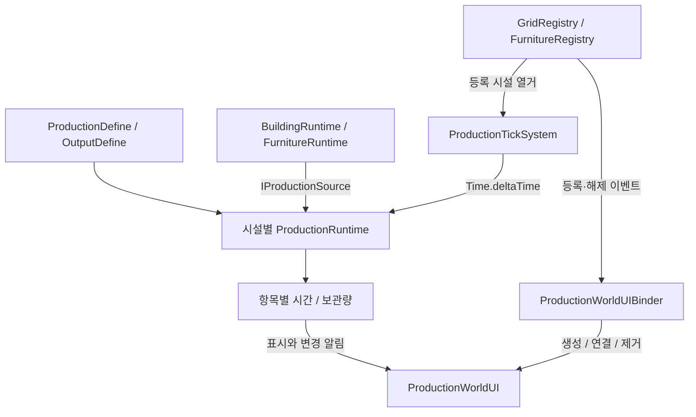

# Production System

[프로젝트 소개](../../README.md) · [전체 아키텍처](../ARCHITECTURE.md) · [Building](Building.md) · [Inventory](Inventory.md)

## 목적과 현재 범위

설치된 건물·가구의 생산 시간과 보관량을 관리하고, 생산물을 인벤토리로 회수합니다. 생산 기능은 시설의 정적 설정에 따라 선택적으로 구성됩니다. 시연과 플레이 검증 결과는 추후 추가합니다.

- 시설별 여러 생산 항목과 항목별 생산 간격·수량·보관 한도
- 등록된 시설에 경과 시간 전달
- 생산물 전체·부분 회수와 남은 수량 복원
- 시설 등록·해제에 따른 World UI 연결

## 해결하려는 문제

- 같은 생산 설정을 사용하는 시설도 진행 시간과 보관량은 각각 달라야 합니다.
- 생산 기능이 없는 건물·가구와 생산 시설을 같은 등록 목록에서 다뤄야 합니다.
- 인벤토리 용량이 부족할 때 수용하지 못한 생산물의 수량을 보존해야 합니다.
- 회수 과정의 임시 수량이 이벤트나 UI를 통해 최종 상태로 전달되지 않도록 순서를 정해야 합니다.

## 주요 클래스와 책임

| 역할 | 클래스·계약 | 책임 |
| --- | --- | --- |
| 시설 생산 설정 | ProductionDefine | 생산 항목 목록 |
| 항목 설정 | ProductionOutputDefine | 아이템, 생산량, 생산 간격과 최대 보관량 |
| 시설 상태 | ProductionRuntime | 시설 하나의 생산 항목 Runtime 관리 |
| 항목 상태 | ProductionOutputRuntime | 경과 시간과 보관량, 변경 알림 |
| 생산 접근 계약 | IProductionSource | 시설의 생산 상태 조회 |
| 반복 처리 | ProductionTickSystem | 등록 시설을 열거하고 경과 시간 전달 |
| 회수 규칙 | ProductionCollectService | Inventory 수용량에 따른 회수와 남은 수량 복원 |
| 시설 목록 | GridRegistry, FurnitureRegistry | 설치된 건물·가구의 등록과 해제 |
| UI 연결 | ProductionWorldUIBinder | 시설별 UI 생성·연결·제거와 회수 요청 전달 |
| 화면 표시 | ProductionWorldUI | 생산 상태 표시와 회수 입력 |

## 처리 흐름

### 시설과 시간

GameSessionController는 월드와 Player 연결이 준비된 뒤 생산 Tick을 활성화합니다. ProductionTickSystem은 Update마다 등록된 건물·가구를 열거하고 Production이 있는 대상에 경과 시간을 전달합니다.

Production이 null인 시설은 생산 기능이 없는 대상으로 정의합니다. Tick과 UI 연결은 이 계약에 따라 건너뜁니다.

### 생산 항목의 시간 처리

1. 이미 보관 한도에 도달했다면 이번 경과 시간을 누적하지 않습니다.
2. 경과 시간을 더하고 생산 간격이 충족된 횟수만큼 생산합니다.
3. 남은 보관 공간을 넘지 않는 수량만 더합니다.
4. 보관 한도에 도달하면 남은 경과 시간을 0으로 만듭니다.
5. 보관량이 바뀌었다면 해당 Advance 호출의 마지막에 변경을 알립니다.

긴 Frame으로 여러 생산 간격이 지난 경우에도 보관 한도 안에서 여러 주기를 처리합니다. 별도 스케줄러 대신 Frame 경과 시간을 전달하는 현재 구현입니다.

### 생산물 회수

TakeStoredAmount로 보관량을 먼저 비워 Inventory 변경 이벤트에서 같은 수량을 다시 회수하지 않도록 합니다. TryAdd 결과의 RemainAmount를 복원한 뒤 최종 보관량 변경을 알립니다.

회수는 진행 중인 생산 시간을 초기화하지 않습니다. 예를 들어 보관 10개 중 Inventory가 4개를 수용하면 시설에 6개가 남습니다. 이 수치는 처리 설명을 위한 예시입니다.

### World UI 수명주기

- Binder가 연결되면 시설 등록·해제 이벤트를 구독하고 기존 시설의 UI도 구성합니다.
- 생산 기능이 있는 시설의 자식으로 UI를 생성하고 카메라·생산 상태·회수 콜백을 연결합니다.
- 시설 등록 해제 시 해당 UI를 정리합니다.
- Binder의 연결 해제·비활성화 시 구독과 생성한 UI를 정리합니다.

UI는 회수 입력을 전달하고, Inventory에 추가할 수량과 남은 수량의 처리는 CollectService가 담당합니다.

## 실패 조건과 수량 처리

| 상황 | 현재 처리 |
| --- | --- |
| 생산 기능이 없는 시설 | Tick·World UI 대상에서 제외 |
| 보관 한도 도달 | 추가 생산을 멈추고 남은 생산 시간 초기화 |
| 회수할 보관량이 0 | false, Inventory 추가 요청 없음 |
| Inventory가 전량 수용 | 시설 보관량 0, 실제 추가량 기준으로 성공 |
| Inventory가 일부만 수용 | 남은 수량 복원, 1개 이상 추가되면 성공 |
| Inventory가 아무것도 수용하지 못함 | 요청한 보관량 복원, false |
| 회수할 Output 또는 수신 계약이 누락 | 개발 오류로 예외 발생 |
| ProductionRuntime에 음수 경과 시간 전달 | 개발 오류로 예외 발생 |

잔여 수량 복원은 TryAdd가 정상적으로 반환한 결과를 처리합니다. 예외 발생까지 포함한 저장 트랜잭션이나 자동 복구 기능으로 설명하지 않습니다.

## 설계 선택과 효과

- **Define와 Runtime 분리:** 시설들은 생산 설정을 공유하고 진행 상태는 개별 보유합니다.
- **Tick 분리:** 생산 시간 전달과 시설 등록, 아이템 회수를 각 담당 객체에서 처리합니다.
- **시설 공통 계약:** 건물·가구가 같은 IProductionSource로 생산 기능을 노출합니다.
- **최종 상태 알림:** 회수 도중 임시로 비운 상태에서 알리지 않고 잔여 수량을 반영한 뒤 알립니다.
- **부분 회수:** 실제 Inventory 수용량만큼 시설 보관량을 줄입니다.

## 현재 제약과 개선

- 현재 Tick은 매 Frame 전체 등록 시설에서 생산 상태를 조회합니다. 시설 수 증가에 따른 비용은 추후 측정해야 합니다.
- 오프라인 생산, 저장·복원과 클론·중력 안정장에 따른 생산 조건은 향후 확장 범위입니다.
- 현재 반복 생산 과정에는 레시피 입력 재료 소비가 포함되어 있지 않습니다.
- 생산 항목의 필수 참조와 설정 검증을 포함한 실행 검증 결과는 추후 추가합니다.

확인할 시나리오는 여러 생산 주기 경과, 보관 한도 직전 생산, Inventory 부분 수용·수용 실패, 회수 중 상태 알림, 시설 제거와 UI 정리입니다. 위 항목은 검증 계획이며 테스트 통과 결과가 아닙니다.

## 코드 링크

- [ProductionDefine](../../Assets/_Project/02.Scripts/_Data/Production/ProductionDefine.cs)
- [ProductionRuntime과 IProductionSource](../../Assets/_Project/02.Scripts/Production/ProductionRuntime.cs)
- [ProductionTickSystem](../../Assets/_Project/02.Scripts/Production/ProductionTickSystem.cs)
- [ProductionCollectService](../../Assets/_Project/02.Scripts/Production/ProductionCollectService.cs)
- [ProductionWorldUIBinder](../../Assets/_Project/02.Scripts/UI/World/ProductionWorldUIBinder.cs)
- [ProductionWorldUI](../../Assets/_Project/02.Scripts/UI/World/ProductionWorldUI.cs)
