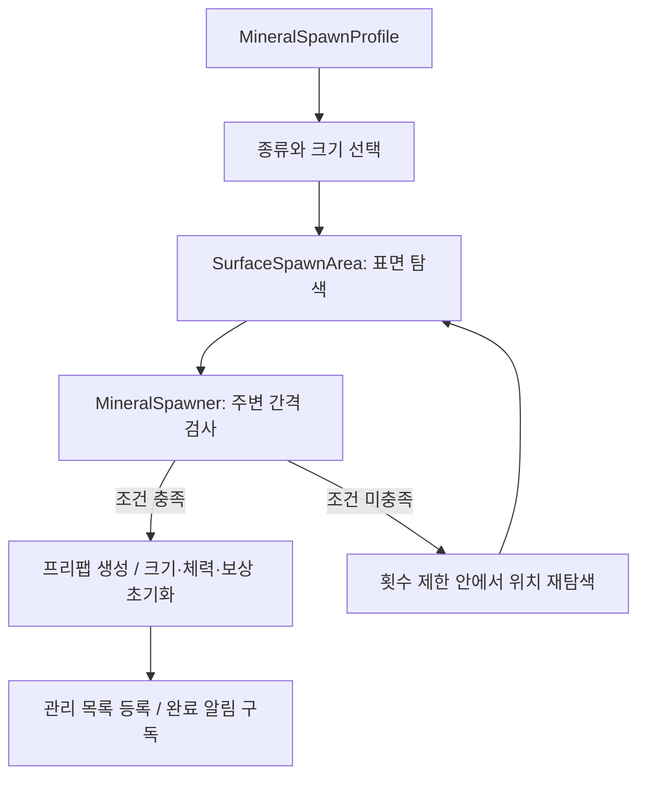

# Resource & Mining System

[프로젝트 소개](../../README.md) · [전체 아키텍처](../ARCHITECTURE.md) · [Inventory](Inventory.md) · [Equipment](Equipment.md)

## 목적과 현재 범위

월드에 광물을 배치하고, 플레이어의 채광 요청을 검사해 인벤토리에 자원을 지급합니다. 개체 수 유지 모드에서는 채광이 끝난 광물을 관리 목록에서 빼고 부족한 수를 지연 보충합니다. 시연과 플레이 검증 결과는 추후 추가합니다.

- 가중치에 따른 광물 종류 선택과 크기 범위 적용
- 지정 영역에서 지표면·표면 방향·주변 간격을 확인한 배치
- 초기 개체 생성, 완료 알림과 선택적 보충
- 장비의 채광 가능 여부·사거리·쿨다운·피해 검사
- 크기에 따른 광물 체력·보상량과 인벤토리 보상 지급

## 해결하려는 문제

- 광물의 종류와 크기를 바꿀 때 생성 처리 코드를 함께 수정하지 않아야 합니다.
- 무작위 위치를 선택하더라도 광물이 지표면에 놓이고 주변 공간을 확보해야 합니다.
- 배치할 공간이 부족하면 탐색을 종료하고 재시도 시점을 정해야 합니다.
- 광물의 남은 체력과 채광 가능 조건, 인벤토리 수용 규칙을 각각 담당하는 곳이 필요합니다.

## 주요 클래스와 책임

| 역할 | 클래스·계약 | 책임 |
| --- | --- | --- |
| 생성 설정 | MineralSpawnProfile, MineralSpawnEntry | 광물 프리팹, 선택 가중치와 크기 범위 |
| 지표면 탐색 | SurfaceSpawnArea, SurfaceSpawnPoint | BoxCollider 영역에서 표면 탐색, 위치·방향·법선 반환 |
| 생성·개체 수 관리 | MineralSpawner | 종류·크기 선택, 간격 검사, 생성과 완료 구독, 보충 일정 |
| 광물 설정 | MineralDefine | 기본 체력·방어력, 보상 아이템·기본 수량·크기 증가 간격 |
| 광물 상태 | MineralRuntime | 크기·체력·보상량, 체력 소진과 완료 상태, 완료 알림·제거 |
| 요청 전달 | MiningGateway, LocalMiningGateway | 채광 요청과 완료 결과 전달 |
| 채광 규칙 | MiningService | 장비·거리·쿨다운 검사, 피해 계산과 보상 지급 조율 |
| 보상 수신 | IInventoryItemReceiver | 인벤토리 추가 요청과 실제 추가량·잔여량 반환 |

## 처리 흐름

### 광물 생성

1. 생성 설정에서 양수 가중치를 가진 광물을 선택하고 해당 항목의 크기 범위에서 값을 뽑습니다.
2. SurfaceSpawnArea가 BoxCollider 내부의 무작위 점에서 지정 방향으로 Raycast합니다. 표면 레이어와 표면 방향 조건을 만족하는 지점을 찾습니다.
3. 표면 법선에 맞춰 광물의 위쪽 방향을 정하고, 그 법선 주위의 회전값을 무작위로 적용합니다. 생성 위치에는 표면 법선 방향의 간격을 더합니다.
4. Spawner가 관리 중인 광물과의 거리를 크기 기반 반경으로 확인합니다. 장애물 레이어를 지정한 경우 Physics.CheckSphere도 수행합니다.
5. 조건을 만족하면 광물을 생성·초기화하고 완료 이벤트를 구독합니다. 위치 탐색은 maxSpawnAttempts 안에서 수행합니다.

표면 방향 조건은 탐색 방향의 반대 벡터와 표면 법선의 내적을 기준으로 합니다. 주변 간격 검사는 설정한 반경과 레이어를 사용하므로 모든 광물 Mesh의 겹침을 정밀하게 판정하는 방식은 아닙니다.

### 크기에 따른 상태

MineralRuntime은 크기를 최소 1로 보정하고, 크기를 모델의 균일 Scale과 최대 체력 계산에 사용합니다. 광물 종류의 기본 설정은 공유하지만 남은 체력과 완료 여부는 각 광물이 보유합니다.

- 최대 체력 = 기본 체력 × 크기
- 보상 수량 = 기본 보상량 + 내림((크기 - 1) / 보상 증가 간격)
- 방어력 = 광물 설정의 방어력

크기가 커지면 체력은 비례해 증가하고 보상은 설정 간격마다 1개씩 증가합니다.

### 채광과 보상

1. 장비의 채광 가능 여부와 광물 상태를 확인합니다.
2. 플레이어에서 타격 지점까지의 거리와 플레이어별 다음 채광 가능 시간을 검사합니다.
3. 다음 채광 가능 시간을 갱신한 뒤 공격력에서 광물 방어력을 뺍니다. 계산값이 양수가 아니면 설정된 최소 피해량을 사용합니다.
4. 피해를 적용해도 체력이 남으면 이번 피해 결과를 반환합니다. 체력이 소진되면 전체 보상을 인벤토리에 추가합니다.
5. 인벤토리 추가 결과를 받은 뒤 광물을 완료 처리합니다. 완료 이벤트를 발생시키고 광물 객체를 제거합니다.

LocalMiningGateway는 Service를 즉시 호출하고, 완료 결과는 공용 응답 큐로 전달합니다. 보상으로 발생한 인벤토리 변경 이벤트가 먼저 큐에 들어가며 완료 결과는 그 뒤에 등록됩니다. 연결 버전이 달라진 이전 완료 응답은 적용하지 않습니다.

현재는 인벤토리에 들어가지 못한 채광 보상을 폐기합니다. 예를 들어 보상 10개 중 4개만 들어가면 광물은 제거되고 6개는 남지 않습니다. 시설에 잔여 수량을 복원하는 [생산물 회수](Production.md)와 다른 현재 정책입니다.

### 초기 생성과 보충

- Spawner의 Start에서 목표 개체 수만큼 초기 생성을 시도합니다. 한 개체의 생성에 실패하면 초기 생성 반복을 종료합니다.
- None 모드에서는 완료 후 보충하지 않습니다.
- MaintainCount 모드에서는 목표 수에 못 미칠 때 보충 코루틴 하나를 실행합니다.
- 설정 범위의 대기 시간이 지난 뒤 한 개체를 생성하고, 여전히 부족하면 다시 대기합니다. 생성 실패 시에는 별도의 실패 재시도 간격을 사용합니다.
- 비활성화 시 보충을 중단하며, 다시 활성화되면 초기 시작 여부와 현재 수량에 따라 보충을 재개합니다.

보충 위치는 새로 탐색하므로 채광한 광물과 같은 위치·종류로 다시 생성된다는 보장은 없습니다.

## 실패 조건과 상태 처리

| 상황 | 현재 처리 |
| --- | --- |
| 표면을 찾지 못하거나 방향·간격 조건 불충족 | 제한 횟수 안에서 위치 재탐색, 소진하면 이번 생성 실패 |
| 초기 생성 중 실패 | 경고 후 초기 생성 반복 종료, MaintainCount에서는 이후 보충 시도 |
| 보충 중 생성 실패 | 실패 재시도 간격만큼 대기 |
| 채광 불가 장비·사거리 초과·쿨다운 미충족 | 실패 이유 반환, 광물 피해·보상 처리 없음 |
| 최종 피해량이 0 이하 | 공격력 부족 결과 반환, 앞서 갱신한 쿨다운은 유지 |
| 광물 체력이 남음 | 적용한 피해 결과 반환, 보상 지급 없음 |
| 인벤토리 부분 수용·수용 불가 | 실제 추가량을 결과에 포함, 잔여 보상은 폐기하고 광물 완료 |
| 필수 생성 설정 누락·잘못된 가중치 또는 크기 범위 | 생성 초기화의 설정 검증에서 개발 오류 처리 |
| 보상 수신 계약 또는 Local Service 연결 누락 | 개발 오류로 예외 발생 |

## 설계 선택과 효과

- **생성 설정 분리:** 광물 비율과 크기 범위를 Profile로 조정합니다.
- **표면 탐색 분리:** 위치·방향을 찾는 과정과 광물 생성·개체 수 관리를 나눕니다.
- **탐색 횟수와 대기 시간:** 배치 실패를 무한 반복하지 않고, 보충 모드에서 다음 시도 시점을 정합니다.
- **완료 알림:** Spawner가 관리하는 광물의 완료를 받아 수량을 갱신합니다.
- **보상 접근 계약:** 슬롯·무게 규칙은 인벤토리에 맡기고 MiningService는 채광 조건과 지급 순서를 조율합니다.

## 현재 제약과 개선

- Spawner 하나가 생성·관리 목록·보충을 함께 담당합니다. 별도 광물 Factory·Registry·Tick System은 없습니다.
- 자체 광물 간 거리 검사는 해당 Spawner의 관리 목록에 한정됩니다. 다른 Spawner의 광물이나 장애물은 설정한 장애물 레이어 검사의 적용 여부에 따라 달라집니다.
- 배치 가능한 공간이 부족하면 목표 개체 수를 채우지 못할 수 있습니다.
- 채광 완료 외의 외부 Destroy에 맞춰 관리 목록을 정리하는 경로는 현재 Spawner에 없습니다.
- 수용하지 못한 보상을 버리는 정책과 장비·자원 설정의 균형은 플레이 검증 후 보완할 수 있습니다.
- 현재 요청은 Local 구현입니다. 광물 상태 저장·복원, 생성 결과의 재현과 네트워크 동기화는 추가 설계가 필요합니다.

확인할 시나리오는 표면 탐색 실패, 좁은 영역의 생성 중단, 보충 모드 전환, 크기별 체력·보상, 사거리·쿨다운 실패, 인벤토리 부분 수용입니다. 위 항목은 검증 계획이며 테스트 통과 결과가 아닙니다.

## 코드 링크

- [MineralSpawnProfile](../../Assets/_Project/02.Scripts/_Data/Mineral/MineralSpawnProfile.cs)
- [SurfaceSpawnArea](../../Assets/_Project/02.Scripts/World/Spawn/SurfaceSpawnArea.cs)
- [MineralSpawner](../../Assets/_Project/02.Scripts/Mineral/Spawn/MineralSpawner.cs)
- [MineralDefine](../../Assets/_Project/02.Scripts/_Data/Mineral/MineralDefine.cs)
- [MineralRuntime](../../Assets/_Project/02.Scripts/Mineral/MineralRuntime.cs)
- [LocalMiningGateway](../../Assets/_Project/02.Scripts/Mineral/Gateway/LocalMiningGateway.cs)
- [MiningService](../../Assets/_Project/02.Scripts/Mineral/Service/MiningService.cs)
